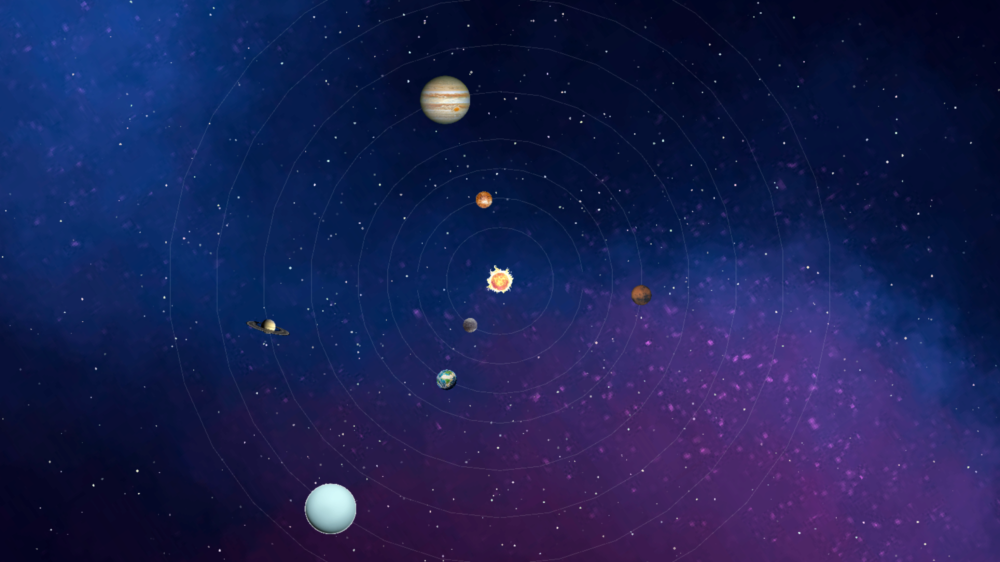

# NEKO GALAXY



A real time, procedural 2D space simulation built with **C++** and **SFML**. This project renders a dynamic spiral galaxy featuring thousands of shimmering stars, a pulsing central nebula, and a solar system with planets following orbital paths.

## 🚀 Features
* **Procedural Spiral Generation:** Stars are distributed using a spiral tightness algorithm to create distinct galactic arms.
* **Dynamic Lighting:** Real-time alpha blending and "twinkle" effects on stars.
* **Orbital Mechanics:** A central sun with 8 orbiting planets, each with unique speeds, scales, and visible orbital rings.
* **Visual Effects:** A pulsing, rotating central nebula using additive blending for a "glow" effect.

---

## 🛠 Prerequisites

You need the SFML development libraries installed.

On Ubuntu/Debian/Mint, run:

```bash
sudo apt update
sudo apt install libsfml-dev g++
```

On Fedora/RHEL:

```bash
sudo dnf install SFML-devel gcc-c++
```

On Arch Linux:

```bash
sudo pacman -S sfml gcc
```

On macOS (Homebrew):

```bash
brew install sfml
```

---

## 🏗️ Build

From the repository root:

```bash
g++ -std=c++17 main.cpp -o solarsystem -lsfml-graphics -lsfml-window -lsfml-system
```

If SFML is installed in a custom location, specify include/link paths:

```bash
g++ -std=c++17 -I/path/to/sfml/include main.cpp -L/path/to/sfml/lib -o solarsystem -lsfml-graphics -lsfml-window -lsfml-system
```

## ▶️ Run

Ensure `sprites/` is in the current working directory, then run:

```bash
./solarsystem
```

## 🧩 Notes

- Uses Fullscreen mode by default (Esc closes).
- If textures fail to load, confirm `sprites/*.png` exist and executable path is repo root.
- On Windows, compile with MinGW or MSVC and link sfml-graphics, sfml-window, sfml-system.

